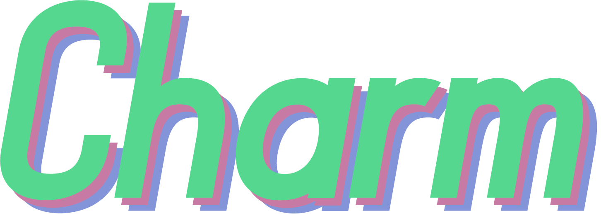

# Charm
A Python-based rhythm engine/game/chart player. Feels like an arcade cabinet, is the hope.

## What?
I'm just messing around for now. I want to get Clone Hero (and everything elses) `.chart` and `.mid` charts to load in it in some readable way, and playable. Later on, I want to add more types of rhythming. This likely won't feel good to play right away, but it'll get there. It'll be 2D and made in PyGame (for now, but I don't see that changing.) Hoping to make it versitile enough to slot in new types of chart later. Anywho, Charm!

## Planned Supported Chart Formats

* `.chart`, various guitar games **(somewhat complete)**
* `.mid` (chart), various guitar games, notably Frets on Fire
* `.osu` and `.osz` (mania/taiko), [osu!mania and osu!taiko](https://osu.ppy.sh/wiki/en/osu%21_File_Formats)\*
* `.sm`, [StepMania](https://strategywiki.org/wiki/StepMania/Creating_songs)
* `.bms/.bme/.pms`, [Lunatic Rave 2 and Pop'n Music](https://github.com/BMS-Community/resources#bms-creation), a Beatmania iidx "simulation"
* `.1`, [Beatmania iidx](https://github.com/SaxxonPike/rhythm-game-formats/blob/master/iidx/1.md), the actual arcade binary chart format (low priority)

\* The popular Roblox rhythm game *Robeats* also loads `.osz` charts.

