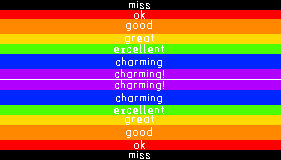

# Charm: General Documentation

## Accuracy Mode
Certain gamemodes in *Charm* don't count accuracy by default, but they all have the option to turn on or off **Accuracy Mode**. Accuracy mode adds two key features, [Judgements](#judgements) and [Grades](grades).

Along with Accuracy Mode, *Charm* will have a seperate mode (name TBD), which shows Judgements and Grades to the player, but without affecting score.

### Judgements
As you play, very note you hit falls within a certain *hit window*. Depending on how close to 0ms (or rather, the notes optimal hit time) your hit lands, depends on how well it's judged. Different judgements give certain point values.

The following table assumes a ±70ms hit window, the default for *Guitar Hero* gamemode. However, the percentage of the window each judgement fills is the same for each gamemode (by default, they can be modified by the user and loaded into presets.)

| Name                       | Sprite | ±ms (min) | ±ms (max) | ±%              | Percent Range | Points |
|----------------------------|--------|-----------|-----------|-----------------|---------------|--------|
| Charming! (Super Charming) || 0         | 10        | 0% / 14.29%     | 14.29%        | 1000   |
| Charming                   || 10        | 25        | 14.29% / 35.71% | 21.43%        | 1000   |
| Excellent                  || 25        | 35        | 35.71% / 50%    | 14.29%        | 800    |
| Great                      || 35        | 45        | 50% / 64.29%    | 14.29%        | 600    |
| Good                       || 45        | 60        | 64.29% / 85.71% | 21.43%        | 400    |
| OK                         || 60        | 70        | 85.71% / 100%   | 14.29%        | 200    |
| Miss                       || 70        | Inf       | N/A             | N/A           | 0      |

Here's a visualization of the above window:

### Grades
At the end of the song, you are given a grade, a letter representing how well you did in the song.

The percent value (PV) used to determine your grade is calculated by the formula `final_score / total_possible_score`, where `total_possible_score` would be the score if the user had hit all the notes in the song with `Charming!` and never broke combo (including overstrums, etc.), but ignoring multiplier, star power (or equivalent), and sustain breaks.

`final_score` also is calculated as if multipliers, star power, sustain breaks, etc. did not factor in.

| Grade | Sprite                                                            | PV   |
|-------|-------------------------------------------------------------------|------|
| SS    || 100% |
| S     |  | >95% |
| A     |  | >90% |
| B     |  | >80% |
| C     |  | >70% |
| D     |  | >60% |
| F     |  | <60% |

## Full Combo
Full Combo is a seperate system for both [Judgements](#judgements) and [Grades](grades), and enabled regardless of [Accuracy Mode](#accuracy-mode). If a player hits every note in the song, and never breaks combo (what this means varies by game type), the player has "FC'd" the song, and an FC icon appears on that song. They are let know of this on the stats screen after the song.
