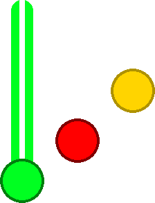
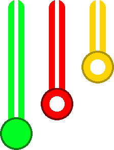
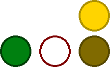

# Guitar Hero
This document attempts to describe the gameplay of the *Guitar Hero*-style gamemode in *Charm.*

## Terminology
* **Frets** are the physical buttons on a guitar controller that can be pressed in varying combinations by the player.
* The **strumbar** is a physical button that can be "strummed" in either direction.
* **Notes** of varying types are the sprites that appear on the "highway" of the screen that tell a player what to do.
  * **Open notes** are purple bars on the highway, which indicate no fret should be held.
* The **strikeline** is the area on screen where a note will be when it's the optimal time to hit that note.
* "**Hitting a note/chord**" refers to successfully activating it within its timing window.
* **Overstrumming** is strumming the guitar when no note should be being hit right now.
* **Chord shapes** are the sequence of frets a player must hold to correctly hit a chord or note.
* **Combo** is maintaining a streak of notes successfully hit, without overstrums or missed notes.

## Different Kinds of Notes
*Guitar Hero* has three main types of notes.

### Normal Notes

"Normal" notes require the player to hold the corresponding fret button (or in the case of the open note, not be holding a fret button), and subsequently[1](#f1) strum the strumbar.

### Tap Notes

"Tap" notes do not *require* the user to strum to activate them, though this is a valid method of hitting the note. If there are two or more of the same tap note in a row, the subsequent notes after the first ust either be strummed, or the fret button must be released and re-pressed.[2](#f2)

### HOPO Notes

"HOPO" notes (short for hammer-on/pull-off) act like taps when the note before them has been "hit" successfully, otherwise they act like normal notes.

### More About Notes
Along with these, any note can also be "sustained", or meant to be held down longer, after the strum. There is no combo penalty for letting go of a sustain early, but you earn points the longer you hold the note. For what happens with sustains overlap, see [Extended Sustains](#extended-sustains) and [Disjointed Chords](#disjointed-chords).

For all these, the frets themselves can be depressed long before the actual note appears on the strikeline, so long as the strum is pressed within the timing window for that note. This has the consequence of meaning tap notes can be held down an arbitrarily long time before their timing window, and still be hit so long as the fret is still pressed by the time the note is within the window.

Hitting a note is detected in the following way:
* In order to "hit" a note, a correct button or sequence of buttons must be hit within a timing window.
* In order to "hit" a chord, all notes in the chord must be hit during the same timing window. [not necessarily at the same time]
* As long as you are within a notes timing window, hitting it is valid and retains combo.
* A note is missed once it leaves it own timing window.
* Inputs are "used" and cannot be used to hit another note/chord once it's been used to hit a note/chord already.

The timing window varies from game to game. In *Clone Hero,* the timing window is 140ms (70 before the time indicated by the note, and 70 after.) This is widely considered to be huge.

### Open Notes Are Weird

Open notes act differently than almost anything else in the game. An open note is represented by a long, thin, purple bar on the highway. This is meant to indicate to the player, "do not touch any frets." Touching any frets while trying to play an open note is considered a miss. This is because open notes have the lowest "pitch" of any note (more on that in [Anchoring](#anchoring).) Technically, you can have an open note in a [Chord](#chords), but you wouldn't be able to play it.

## Chords

Often, you are meant to press multiple notes at once. These are represented by multiple notes appearing on screen in a line. To successfully hit a chord, *all* frets in the chord must be pressed before the strum.[1](#f1) (Or, in the case of tap/hopo chords, before the activation.)

## Star Power Phrases

A Star Power phrase is an event of a certain length on a chart at a specific time. If a chain of notes exists within a Star Power Phrase, hitting every note in that phrase (and not breaking combo) gives a player a quarter bar of Star Power. Players can activate Star Power when they have at least half a bar of Star Power. Whammying sustains during SP phrases (if they haven't been broken) also gives small amounts of Star Power.

## Extended Sustains

Extended sustains are notes whose sustains extended over other notes on the chart. Regardless of the notes' priority on the low -> high scale, holding in these sustains to their completion is valid.

## Disjointed Chords

Disjointed Chords are chords whose beginnings are offset from each other. In theory, this is a consequence of design; you can hold notes that are lower than the current note while playing the new one, and you can hold notes before they are meant to be played.

## Anchoring

### Guitar Hero
For single-note chords, it is a valid chord shape to hold any "lower" fret or combination of lower frets as well as the note that you're supposed to be holding.
Notes are ordered, from low to high, "open" (or no fret), green, red, yellow, blue, orange.

### Clone Hero
In *Clone Hero*, you are able to anchor chords that are either HOPOs (so long as you've hit the chord previous successfully) or taps. Normal chords can never be anchored.

| Chord on Highway | Chord Type | Chord Held | GH?  | CH?  |
|------------------|------------|------------|------|------|
| GRY\_\_          | Normal     | GRY\_\_    | ✅   | ✅   |
| \_RYB\_          | Normal     | GRYB\_     | ❌   | ❌   |
| \_RYB\_          | Tap        | GRYB\_     | ❌   | ✅   |
| \_R\_B\_         | Tap        | GR\_B\_    | ❌   | ✅   |
| \_R\_B\_         | Tap        | GRYB\_     | ❌   | ❌   |
|                  |            |            |      |      |

## Solos
Solo phrases show the currently hit percentage of the total solo on screen. If by the end of the phrase, the player has a certain percentage, they get a certain score bonus.

## Countdown
A countdown appears on screen during long periods (over 5 seconds[3](#f3)) of no upcoming notes.

You may tap and strum randomly during a Countdown without breaking combo.[4](#f4)

## Scoring

Without any modifiers or external forces at play, single notes give 50 points, and held sustains give 25 points per beat.

Hitting a combo of 10 sets your multiplier to 2x, 20 sets it to 3x, and 30 sets it to 4x.

Overstrumming before the first note or after the last note does not break combo.

Activating Star Power doubles your multiplier.

Whammying (in Clone Hero, at least) gives no extra score.[3](#f3)

[Solo phrases](#solos) also give extra points.

## Footnotes
<b id="f1">1</b>: There appears to be some wiggle room here (a few milliseconds?) where the player can strum the strumbar and *then* hold the correct note. This is not the intended way to play, however, and this document will continue describing the intended playstyle as if these engine idiosyncrasies did not exist. I would like to note though that this implentation detail may be required for the engine to "feel good".[↩](#a1)

<b id="f2">2</b>: This makes a string of tap/HOPO open notes (often confusingly referred to as "pull-offs" regardless of if they are HOPOs or tap notes) essentially self-activating. [↩](#a2)

<b id="f3">3</b>: This may be changed for Charm, or in applicable situations, a toggleable feature (since I want score parity with Clone Hero for those who want to participate in score challenges.)[↩](#a3)

<b id="f4">4</b>: Only in Charm.[↩](#a4)
